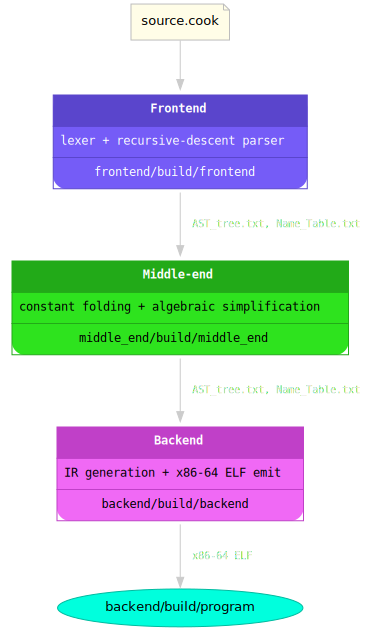
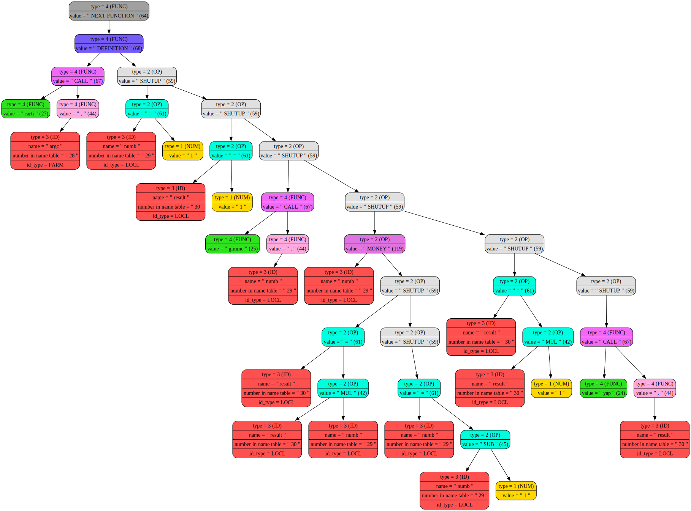

# Cook Programming Language

**Cook** (from *"let him cook"* - slang for "let someone do their thing") is an esoteric programming language with slang keywords, along with a self-contained compiler that turns `.cook` source files into native x86-64 ELF binaries through a three-stage pipeline - no assembler or linker required.

<p align="center">
    
</p>

---

## Table of Contents

- [Language](#language)
  - [Keywords and built-ins](#keywords-and-built-ins)
  - [Arithmetic operators](#arithmetic-operators)
  - [Comparison operators](#comparison-operators)
  - [Built-in functions](#built-in-functions)
  - [Grammar](#grammar-informal)
- [Examples](#examples)
- [Compiler pipeline](#compiler-pipeline)
- [AST format](#ast-format)
- [Middle-end optimisations](#middle-end-optimisations)
- [IR format](#ir-format)
- [Backend codegen](#backend-codegen)
- [Build](#build)

---

## Language

### Keywords and built-ins

| Token / identifier | Meaning                                    |
|--------------------|--------------------------------------------|
| `lethimcook`       | variable declaration / function definition |
| `is`               | assignment (`=`)                           |
| `lesssgo`          | open block (`{`)                           |
| `stoopit`          | close block (`}`)                          |
| `shutup`           | statement terminator (`;`)                 |
| `forreal`          | `if` statement                             |
| `grinding`         | `while` loop                               |
| `gimme`            | read integer from stdin                    |
| `yap`              | print integer to stdout                    |

### Arithmetic operators

| Operator | Meaning                 |
|----------|-------------------------|
| `+`      | addition                |
| `-`      | subtraction             |
| `*`      | multiplication          |
| `/`      | signed integer division |

### Comparison operators

| Keyword  | Meaning |
|----------|---------|
| `fr`     | `>`     |
| `lowkey` | `<`     |
| `nocap`  | `>=`    |
| `nah`    | `!=`    |
| `sameAs` | `==`    |

### Built-in functions

| Function   | Supported in pipeline | Notes                                                      |
|------------|-----------------------|------------------------------------------------------------|
| `gimme(x)` | yes                   | reads integer from stdin into `x`                          |
| `yap(x)`   | yes                   | prints integer to stdout                                   |
| `sqrt(x)`  | yes                   | integer square root (`cvtsi2sd + sqrtsd + cvttsd2si`)      |
| `sin(x)`   | no                    | reserved in enums/optimizer code, not supported end-to-end |
| `cos(x)`   | no                    | reserved in enums/optimizer code, not supported end-to-end |
| `ln(x)`    | no                    | reserved in enums, not supported end-to-end                |

> [!NOTE]
> Current stable built-ins for source programs are `gimme`, `yap`, `sqrt`.

### Grammar (informal)

```
program      ::= { function_def }+ '$'
function_def ::= 'lethimcook' ident '(' params_def ')' block
params_def   ::= 'lethimcook' ident { ',' 'lethimcook' ident }*
block        ::= 'lesssgo' { statement 'shutup' }+ 'stoopit'
statement    ::= declaration | assignment | if_stmt | while_stmt | expr
declaration  ::= 'lethimcook' ident 'is' expr
assignment   ::= ident 'is' expr
if_stmt      ::= 'forreal' '(' comparison ')' block
while_stmt   ::= 'grinding'  '(' comparison ')' block
comparison   ::= expr [ ('fr'|'lowkey'|'nocap'|'nah'|'sameAs') expr ]
expr         ::= term { ('+'|'-') term }*
term         ::= primary { ('*'|'/') primary }*
func_call    ::= ident '(' args ')'
args         ::= expr { ',' expr }*
primary      ::= number | ident | func_call | '(' expr ')'
```

> [!NOTE]
> If no comparison operator is given, `forreal(expr)` tests `expr != 0` and `grinding(expr)` loops while `expr > 0`.

---

## Examples

Sample programs are in [examples/](examples/):

| File                                                | Description                                                 |
|-----------------------------------------------------|-------------------------------------------------------------|
| [factorial_loop.cook](examples/factorial_loop.cook) | Iterative factorial: reads N, prints N!                     |
| [fibonacci.cook](examples/fibonacci.cook)           | Fibonacci: reads N, prints the N-th number                  |
| [quadratic.cook](examples/quadratic.cook)           | Quadratic equation: reads a b c, prints real roots if D ≥ 0 |
| [sqrt_test.cook](examples/sqrt_test.cook)           | Integer square root                                         |
| [if_test.cook](examples/if_test.cook)               | Comparison operators demo                                   |

---

## Compiler pipeline

<p align="center">
    
</p>

---

## AST format

The frontend serialises the AST to a text file consumed by the middle-end (and again by the backend after optimisation). Format is pre-order parenthesised:

```
{ <type>: "<value>"
    <left-subtree>
    <right-subtree>
}
```

**Node types** (integer tag stored in the file):

| Tag | Type   | `value` field meaning                  |
|-----|--------|----------------------------------------|
| 1   | `NUM`  | numeric literal (double)               |
| 2   | `OP`   | operation code (ASCII of enum char)    |
| 3   | `ID`   | index into the name table              |
| 4   | `FUNC` | function-level node (DEF / CALL / ...) |
| 5   | `PARM` | function parameter                     |
| 6   | `LOCL` | local variable declaration             |

**Operation codes** (stored as their ASCII value):

```
+  ADD    -  SUB    *  MUL    /  DIV    ^  POW
s  SIN    c  COS    l  LN
i  IF     w  WHILE  =  EQUAL
;  GLUE   ,  COMMA  @  FN_GLUE
A  ADVT   C  CALL   D  DEF
G  GT     L  LT     g  GTE    n  NEQ    e  EQ
```

> [!NOTE]
> `POW/SIN/COS/LN` codes exist in enums and AST format for compatibility, but are not part of the current stable source-language feature set.

**Name table** - one symbol per line, only user-defined names (keywords excluded):

```
"<name>" <length> <is_keyword> <added_status> <id_type> <host_func> <n_params> <n_locals> <offset>
```

Example for `factorial_loop.cook`:

```
"carti"  5 0 1 0 0 1 2 0
"argc"   4 0 1 5 27 0 0 0
"numb"   4 0 1 6 27 0 0 1
"result" 6 0 1 6 27 0 0 2
```

AST for `factorial_loop.cook` (rendered by Graphviz):



---

## Middle-end optimisations

The middle-end makes repeated passes over the AST until no more changes occur (up to `MAX_OPTIMIZATIONS = 100` iterations). Two transformations are applied per pass:

**1. Algebraic simplifications** (`simplification_typical_operations`):

| Pattern           | Result                                           |
|-------------------|--------------------------------------------------|
| `x * 1`, `1 * x`  | `x`                                              |
| `x * 0`, `0 * x`  | `0`                                              |
| `0 + x`, `x + 0`  | `x`                                              |
| `x ^ 1`           | `x` *(legacy rule for pre-existing `POW` nodes)* |

**2. Constant folding** (`constant_folding`): when both children of an `OP` node are `NUM`, the expression is evaluated at compile time and replaced with a single `NUM` node. Stable folded ops in the current pipeline: `+`, `-`, `*`, `/`.

---

## IR format

The backend reads the optimised AST and emits a flat text IR (`backend/program_beta.ir`). One instruction per line.

**Instructions:**

```
function <name>               - function entry point
param <name>, <reg>           - declare parameter (emitted but not compiled by backend)
end_function                  - function epilogue + ret

set <dst>, <src>              - move: reg←reg or reg←immediate
add <dst>, <src>              - dst += src
sub <dst>, <src>              - dst -= src
mul <dst>, <src>              - dst *= src
div <dst>, <src>              - dst /= src  (signed idiv)
sqrt <reg>                    - reg = isqrt(reg)
pow <dst>, <src>              - dst = dst ^ src  (emitted but not compiled by backend)

call <func>                   - call function; result returned in r0 (rax)

if  <rL> <op> <rR>, <label>  - conditional jump (op: fr lowkey nocap nah sameAs)
if  <rX> != 0, <label>        - legacy form (plain expression condition)
end_if                        - end of if body

while <rL> <op> <rR>, <label> - loop header with comparison (op: fr lowkey nocap nah sameAs)
while <rX> > 0, <label>       - loop header, legacy form (plain expression condition)
end_while                     - jmp back to loop start; emits end_loop_<label>:
```

**Virtual registers** `r0`-`r13` are mapped to x86-64 registers, skipping `rsp`/`rbp`:

```
r0=rax  r1=rcx  r2=rdx  r3=rbx  r4=rsi  r5=rdi
r6=r8   r7=r9   r8=r10  r9=r11  r10=r12 r11=r13 r12=r14 r13=r15
```

Example IR for `factorial_loop.cook`:

```
function carti
param argc, r1
set r2, 1
set r3, 1
call gimme
set r2, r0
while r2 > 0, body383
mul r3, r2
sub r2, 1
end_while
set rdi, r3
call yap
end_function
```

---

## Backend codegen

The backend compiles IR directly to x86-64 machine code and writes a self-contained ELF64 executable (`ET_EXEC`, fixed virtual addresses) - no assembler or linker required for the default pipeline.

**Runtime functions** (emitted before user code):

| Function      | Description                                       |
|---------------|---------------------------------------------------|
| `in_syscall`  | reads one integer from stdin via `sys_read`       |
| `out_syscall` | prints one integer to stdout via `sys_write`      |
| `hlt_syscall` | calls `sys_exit(0)`                               |

**ELF layout** (two `PT_LOAD` segments):

```
offset 0x000000  ELF header + program headers  (64 + 2×56 = 176 bytes)
offset 0x0000B0  .text  (RX)  - code           (virtual: 0x400000)
offset (aligned) .data  (RW)  - output buffer, numeric constants
```

Entry point is `_start`, which calls `carti` then `hlt_syscall`.

---

## Build

Requirements: `gcc`, `make`. Optional: `graphviz` (for AST graphs in `log/`).

```bash
make
```

### Compile and run a program

**With `cook.sh` (recommended):**

```bash
# compile only
./cook.sh examples/factorial_loop.cook

# compile and run (program reads from stdin)
./cook.sh examples/factorial_loop.cook --run
```

**Step by step** (useful for inspecting intermediate files):

```bash
./frontend/build/frontend examples/factorial_loop.cook
./middle_end/build/middle_end
./backend/build/backend
./backend/build/program
```

### Debug build

Rebuild with `-DDEBUG` to enable verbose tracing (parser trace, IR compilation, ELF patching):

```bash
make DEBUG=1
```

Restore normal (silent) build:

```bash
make clean && make
```

### Clean

```bash
make clean
```
